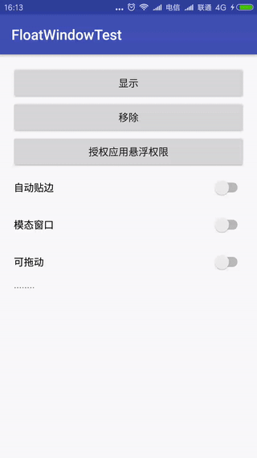

# 一个悬浮创建工具类

### 如何使用
```java
    View contentView = LayoutInflater.from(context).inflate(R.layout.fv_test,null);
    
    FloatWindowUtils floatWindow = new FloatWindowUtils.Builder(context,contentView)
            .setAutoAlign(true) //是否自动贴边
            .setModality(false) //是否模态窗口
            .setMoveAble(true) //是否可拖动
            .create();
    floatWindow.show();
```
### 示例
